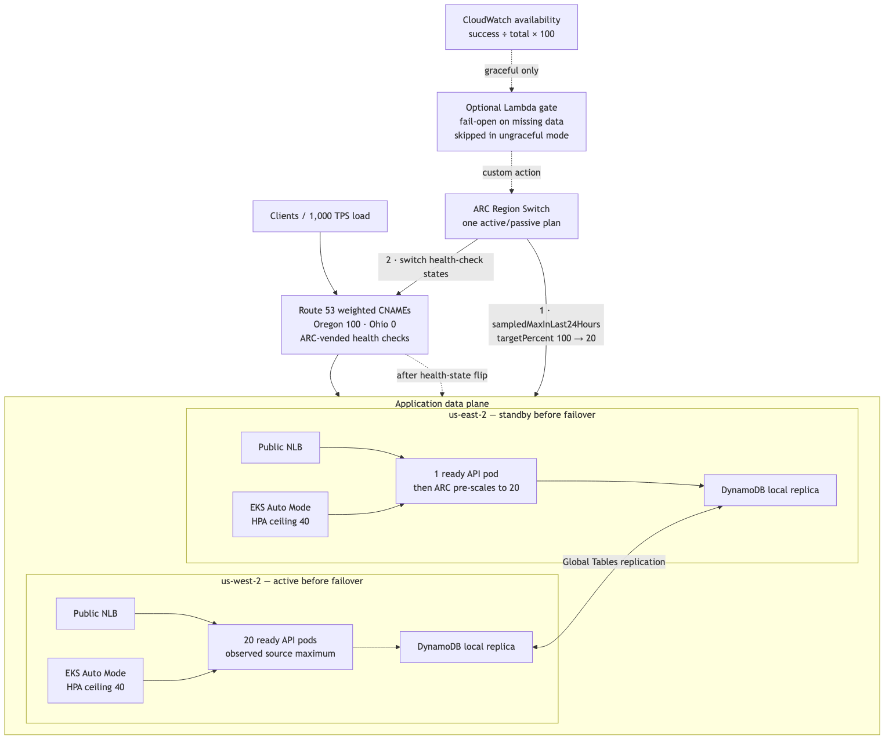
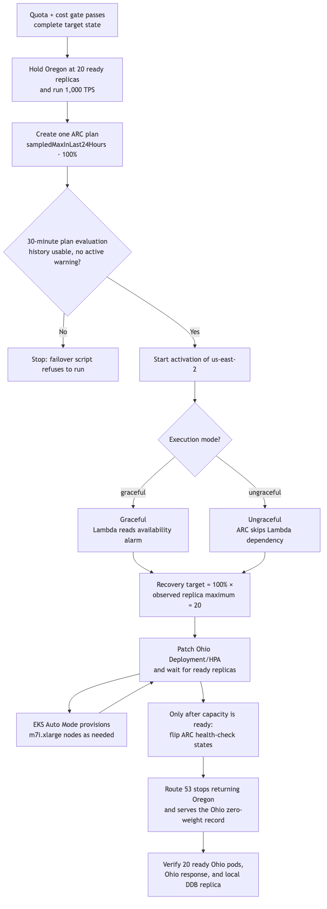

# Pre-scale an EKS regional failover from the last 24 hours—not the HPA ceiling

## A practical ARC Region Switch experiment with two EKS clusters, a DynamoDB Global Table, and no CloudWatch dependency in the recovery path

Regional recovery has an awkward capacity problem.

Keeping a second Region at full production scale is expensive. Keeping it at one pod is cheap, but shifting all production traffic into it can create a second outage while nodes and pods catch up. Scaling every service to its HPA maximum is not a great compromise either: the HPA maximum is a safety ceiling, not evidence that the service ever needed that much capacity.

Amazon Application Recovery Controller (ARC) Region Switch has a useful middle ground for EKS. Its EKS resource scaling execution block can use `sampledMaxInLast24Hours` and scale the recovery Region to a percentage of the maximum replica count ARC observed during the previous 24 hours. In this experiment I set `targetPercent` to 100. The service’s HPA ceiling is 40 pods, but its demonstrated peak is 20, so the recovery target is 20—not 40 and definitely not the standby minimum of one. [AWS documents the EKS scaling block and its capacity-monitoring behavior here](https://docs.aws.amazon.com/r53recovery/latest/dg/eks-resource-scaling-block.html).

The important resilience property is what the block does *not* need during execution: it does not derive the target from a live CloudWatch CPU graph. ARC already has the replica history. That matters when the incident affecting a Region also makes normal observability incomplete or unavailable.

## What I built

The lab uses:

- One EKS Auto Mode cluster in Oregon (`us-west-2`) and one in Ohio (`us-east-2`).
- One namespace and one HTTP transaction service in each Region.
- An HPA range of 1–40 replicas with CPU-based scaling.
- EKS-managed Metrics Server for pod CPU and memory metrics.
- One internet-facing Network Load Balancer per Region.
- A DynamoDB Global Table. Each application instance reads and writes its local replica, so the data tier is multi-active even though ingress begins active/passive.
- Route 53 weighted CNAMEs: Oregon weight 100, Ohio weight 0, with ARC-vended health checks attached.
- One ARC active/passive Region Switch plan.
- A custom CloudWatch availability metric: successful transactions divided by total transactions, multiplied by 100.
- A 97% availability alarm and optional Lambda execution block for a graceful workflow.

The `.example` hosted zone used in the lab is authoritative inside Route 53 but is intentionally not a publicly delegated production domain. A production implementation must use a real delegated domain. Direct NLB requests are used for application validation in this experiment.

## Cost before creation

The live preflight estimated approximately **$1.35 per hour** with the lab ready and approximately **$2.10 per hour** during the temporary failover peak. That includes both EKS control planes, EKS Auto Mode nodes and management fees, one ARC plan, two NLBs, two Route 53 health checks, and the modeled DynamoDB request mix at 1,000 requests per second with eventually consistent reads and 1% writes.

The figures are intentionally below the experiment’s $5–$10/hour ceiling. Response data transfer and an unusually different request mix remain variable.

Standard-support EKS clusters are billed at $0.10 per cluster-hour, and Auto Mode adds a management charge to the underlying EC2 instances. [AWS publishes the current EKS prices here](https://aws.amazon.com/eks/pricing/). ARC Region Switch is listed at $70 per plan per month and is prorated for a partial month; `$70 ÷ 730 ≈ $0.096/hour` is an hourly equivalent, not a promise of exact per-second billing. [AWS publishes ARC pricing here](https://aws.amazon.com/application-recovery-controller/pricing/).

Before any creation, the script verified the AWS account, both target Regions, existing usage, EKS cluster quotas, Standard On-Demand vCPU quotas, VPC quotas, the ARC plan quota, and the final-state cost. The run would stop before partial deployment if the complete target did not fit.

## The history gate is part of the experiment

There is a subtle bootstrap problem: a configuration that says “use the last 24-hour maximum” is not useful until ARC has actually sampled a meaningful replica count.

The pipeline therefore does this in order:

1. Scale Oregon to 20 ready replicas.
2. Hold that state while running a 1,000 requests/second load test.
3. Create the ARC plan with `capacityMonitoringApproach: sampledMaxInLast24Hours` and `targetPercent: 100`.
4. Leave Oregon at 20 replicas while ARC samples the workload.
5. Poll the ARC plan evaluation until it reports `passed` and has no active warning.
6. Write a durable `history-gate.json` evidence file.
7. Refuse to execute failover if that file or passing evaluation is absent.

ARC evaluates plans on a recurring schedule rather than synchronously; AWS documents that plans are evaluated every 30 minutes. [See the execution-block documentation](https://docs.aws.amazon.com/r53recovery/latest/dg/working-with-rs-execution-blocks.html).

This ordering prevents the common mistake of creating the plan while the standby-like one-pod state is the only value ARC has seen.

## The recovery execution

The activation workflow has three execution blocks:

1. **Optional availability gate.** In graceful mode, a Lambda function reads the regional CloudWatch alarm. An `ALARM` state blocks the workflow. `INSUFFICIENT_DATA` or a CloudWatch API error follows the lab’s explicit fail-open policy. For the observability-impairment experiment, ARC runs in ungraceful mode and skips this custom Lambda block. ARC documents the `skip` behavior for ungraceful custom Lambda actions. [See the custom Lambda block documentation](https://docs.aws.amazon.com/r53recovery/latest/dg/custom-action-lambda-block.html).
2. **EKS pre-scale.** ARC calculates 100% of the maximum replicas it sampled in the last 24 hours, patches the Ohio workload/HPA behavior, and waits for the destination replicas to become ready. EKS Auto Mode adds `m7i.xlarge` nodes as required.
3. **Traffic switch.** Only after the capacity block completes does ARC switch the state of its Route 53 health checks. The weighted records stay Oregon 100 / Ohio 0. When the Oregon record’s ARC health check is made unhealthy and the Ohio check is healthy, Route 53 serves the zero-weight Ohio record. [AWS explains the Region Switch Route 53 health-check block here](https://docs.aws.amazon.com/r53recovery/latest/dg/route53-health-check-block.html).

The resulting sequence is deliberately capacity-first and traffic-second.

## GitLab pipeline design

The repository contains reproducible shell scripts and a GitLab CI pipeline:

- `preflight.sh` is read-only and enforces account, quota, current-usage, and cost gates.
- `deploy.sh` creates both EKS clusters in parallel, the DynamoDB Global Table, the service, HPA, NLBs, CloudWatch alarms, Lambda functions, and ARC permissions.
- `prime-and-create-plan.sh` produces the 20-replica observation, runs the load test, publishes its measured availability, creates the single ARC plan, attaches the vended health checks, and waits for plan evaluation.
- `failover.sh` refuses to run without the history gate, starts an ungraceful activation of Ohio, and validates destination capacity and application identity.
- `teardown.sh` is a separate manual action. There is no automatic failback or cleanup during review.

The GitLab jobs that mutate infrastructure are manual. Preflight and validation run first, while deploy, history priming, failover, and teardown remain explicit operator decisions.

## Results

The source load test completed at **{{REQUESTS_PER_SECOND}} requests/second** with **{{AVAILABILITY_PERCENT}}% measured transaction availability**.

ARC’s plan evaluation passed after **{{PLAN_EVALUATION_MINUTES}} minutes** with the Oregon source held at 20 ready replicas. The failover execution completed in **{{FAILOVER_MINUTES}} minutes**. Ohio reached **{{EAST_READY_REPLICAS}} ready replicas** before the Route 53 block completed, and a direct request to the destination NLB returned `us-east-2`.

The DynamoDB request path continued against the local Ohio replica after the switch.

## What this does—and does not—prove

This experiment demonstrates that the recovery capacity target can come from ARC’s previously observed EKS replica count instead of a live CloudWatch utilization query, and that a custom monitoring-dependent block can be skipped in an ungraceful, fail-at-all-costs recovery.

It does not mean monitoring is unnecessary. Availability, latency, error rate, saturation, replication health, and business-level correctness are still essential before and after an incident. The point is narrower: a recovery control plane should not make an already-known capacity target depend on the same regional telemetry path that may be impaired.

It also does not make 100% of the observed maximum universally correct. Teams should add safety margin where growth, diurnal peaks, retry storms, or correlated failures justify it. But an observed peak is a much more defensible baseline than blindly scaling every service to its HPA ceiling.

## Takeaway

Warm standby capacity should be cheap, but recovery capacity should be evidence-based.

For EKS, ARC Region Switch can remember the maximum replica count it observed during the last 24 hours, pre-scale the destination to that demonstrated level, wait for readiness, and then move traffic—all without asking a potentially impaired monitoring system to rediscover the number during the incident.

That is a practical way to reduce steady-state waste without turning the first minutes of failover into an uncontrolled autoscaling race.
