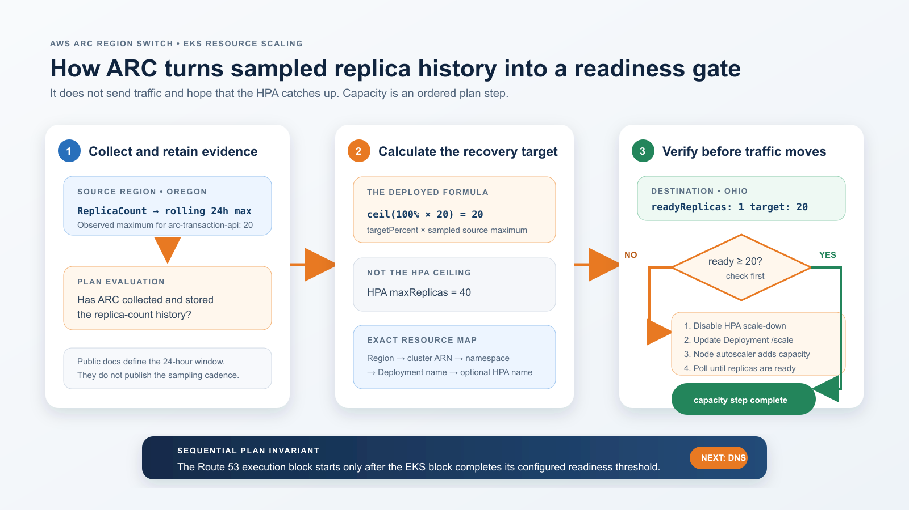

# When Observability Fails: How AWS ARC Remembers EKS Capacity for Regional Recovery

## A measured AWS ARC Region Switch experiment showing how stored EKS replica history determines recovery capacity and live Kubernetes readiness gates traffic movement

## TL;DR — the business case

Regional resilience normally forces an uncomfortable financial choice: pay continuously for a second Region at full production scale, or keep a small standby and accept a longer, riskier recovery. Scaling every standby service to its HPA ceiling during an incident is not a satisfying answer either. It can waste scarce regional capacity, increase cost, and lengthen recovery while infrastructure provisions capacity the application has never demonstrated it needs.

ARC Region Switch offers a more deliberate operating model. A business can keep the recovery Region small during normal operation, retain an evidence-based capacity target before an incident, and enforce the sequence **policy → capacity → traffic** as one recovery workflow. That can lower standby cost without making a live dashboard the source of truth for how many pods recovery requires.

This experiment demonstrates the model with Oregon serving traffic on 20 pods and Ohio beginning with one. ARC:

1. Uses the maximum replica count it collected and stored over the previous 24 hours to calculate a 20-pod recovery target—not the HPA ceiling of 40 and not a live CPU graph.
2. Checks the destination’s live Kubernetes readiness state, requests the missing capacity, and waits for the EKS scaling step to succeed.
3. Starts the Route 53 traffic step only after the capacity step completes.

The business outcome is a less expensive warm standby with a controlled recovery path and auditable evidence that capacity preceded traffic. The important boundary is that ARC does not eliminate observability: this lab did not simulate a CloudWatch outage, and ARC still needs its stored pre-incident replica history plus live access to EKS and the compute capacity being requested. What it removes from this ungraceful recovery path is a **live CloudWatch or Prometheus utilization lookup for deciding the pod target**.

Regional recovery has an awkward capacity problem.

Keeping a second Region at full production scale is expensive. Keeping it at one pod is cheap, but sending all production traffic to that pod can create a second outage while nodes and pods catch up. Scaling every service to its HPA maximum is not a good compromise either: an HPA maximum is a safety ceiling, not evidence that the service ever needed that much capacity.

Amazon Application Recovery Controller (ARC) Region Switch has a useful middle ground for EKS. Its EKS resource-scaling execution block can use `sampledMaxInLast24Hours` and recover to a percentage of the maximum replica count ARC collected and stored for the configured Kubernetes resource during the previous 24 hours. This is ARC-managed replica-count history—not a query against a live CloudWatch CPU graph, Prometheus, or the HPA ceiling. In this experiment:

- The HPA range is 1–40.
- Oregon (`us-west-2`) is deliberately held at a demonstrated peak of 20 ready pods.
- Ohio (`us-east-2`) starts at one ready pod.
- `targetPercent` is 100.
- ARC therefore pre-scales Ohio to 20—not 40 and not one—before changing the routing state.

[AWS documents the EKS scaling block and its sampled-capacity behavior here](https://docs.aws.amazon.com/r53recovery/latest/dg/eks-resource-scaling-block.html).


*The architecture is intentionally simple: ARC applies an optional policy gate, restores the demonstrated 20-pod capacity in Ohio, waits for readiness, and only then changes the Route 53 health state. DynamoDB Global Tables keeps the data plane active/active.*

[Image: A clean two-Region architecture diagram showing the ARC policy, capacity, and traffic sequence; Oregon and Ohio EKS services; local DynamoDB replicas; the one-to-20-pod recovery; and the intentionally unused 40-pod HPA ceiling.]

The resilience property I wanted to test was what this recovery path does *not* require. ARC does not need to discover the target from a live CloudWatch CPU graph during the incident. Plan evaluation has already confirmed that ARC collected and stored the required replica-count history. That matters when a regional impairment also makes normal observability incomplete or unavailable.

The skeptical SRE question is:

> How does ARC know that the standby Region has enough capacity—and that the capacity is actually ready to take production traffic?

That is really two questions with two different signals:

- **How much capacity?** ARC uses stored replica-count history from before the incident.
- **Is that capacity usable now?** ARC uses live Kubernetes Deployment readiness state during execution.

The remembered maximum supplies the number. The readiness gate supplies the go-signal. Only after both does the sequential traffic step begin.

## The recovery contract

The lab uses:

- One EKS Auto Mode cluster in Oregon and one in Ohio.
- One `arc-lab` namespace and one HTTP transaction service per Region.
- EKS-managed Metrics Server for pod CPU and memory metrics.
- An HPA range of 1–40 replicas with CPU-based scaling.
- `m7i.xlarge` capacity, selected to keep pod startup responsive without exceeding the experiment’s budget.
- One internet-facing Network Load Balancer per Region.
- A DynamoDB Global Table. Every pod reads and writes its local regional replica.
- Route 53 weighted CNAMEs: Oregon weight 100 and Ohio weight 0, with ARC-vended health checks attached.
- One ARC active/passive Region Switch plan.
- A custom `AvailabilityPercent` CloudWatch metric and a 97% alarm.
- One regional Lambda function per Region, referenced by the custom block in each activation workflow.

The application and data tier are deployed in both Regions, but ingress begins active/passive. ARC supports either one reusable activation workflow or two separate activation workflows for an active/passive plan. This plan deliberately contains two: Oregon-to-Ohio and Ohio-to-Oregon. The experiment executes only Oregon-to-Ohio. There is no automatic failback.

The `.example` hosted zone in this account is authoritative inside Route 53 but intentionally is not a publicly delegated production domain. I validated the application directly through the destination NLB. A production implementation must use a real delegated domain.

## Cost and quota gate before creation

The live preflight estimated approximately **$1.45 per hour** with the lab ready and approximately **$2.20 per hour** during the temporary failover peak. That includes:

- Two EKS control planes.
- EKS Auto Mode compute and management charges.
- One NAT gateway per Region for private-node egress.
- One ARC Region Switch plan.
- Two NLBs.
- Two Route 53 health checks.
- The modeled DynamoDB request mix for a 1,000-TPS target, using eventually consistent reads and about 1% writes.

Data transfer and a materially different request mix remain variable. The estimate stayed below the experiment’s $5–$10/hour ceiling.

Before creating anything, the preflight checked the AWS account, both Regions, current usage, EKS cluster quotas, Standard On-Demand vCPU quotas, VPCs, Elastic IPs, NAT gateways, NLBs, IAM roles, Route 53 health checks, and the ARC plan quota. The build stopped unless the complete target state fit.

EKS standard-support clusters are currently listed at $0.10 per cluster-hour, with Auto Mode adding management charges to the underlying EC2 instances. [AWS publishes EKS pricing here](https://aws.amazon.com/eks/pricing/).

ARC Region Switch is listed at $70 per plan per month and is prorated for partial months. `$70 ÷ 730 ≈ $0.096/hour` is a useful hourly equivalent, not a claim of per-second billing. [AWS publishes ARC pricing here](https://aws.amazon.com/application-recovery-controller/pricing/).

## How the ARC plan is composed

The Ohio activation workflow contains three ordered execution blocks:

1. `CustomActionLambda` — an optional availability guard for graceful recovery.
2. `EKSResourceScaling` — capacity-first recovery using the sampled 24-hour maximum.
3. `Route53HealthCheck` — traffic movement only after the compute step finishes.

That order is the design: policy first, capacity second, traffic third.


*The live ARC workflow builder shows the actual order: custom Lambda policy, EKS observed-capacity scaling, then Route 53 traffic control.*

[Image: An annotated real AWS ARC workflow-builder screenshot with numbered callouts on the Lambda, EKS scaling, and Route 53 health-check execution blocks.]

### Block 1: the custom Lambda execution block

The custom block is defined twice in the plan—once for each activation workflow—and points to one Lambda function in each Region:

```json
{
  "name": "Availability signal gate",
  "description": "Graceful mode checks CloudWatch; missing data fails open. Ungraceful mode skips this dependency.",
  "executionBlockType": "CustomActionLambda",
  "executionBlockConfiguration": {
    "customActionLambdaConfig": {
      "lambdas": [
        {
          "arn": "arn:aws:lambda:us-west-2:ACCOUNT_ID:function:arc-eks-24h-availability-gate"
        },
        {
          "arn": "arn:aws:lambda:us-east-2:ACCOUNT_ID:function:arc-eks-24h-availability-gate"
        }
      ],
      "retryIntervalMinutes": 0.5,
      "regionToRun": "activatingRegion",
      "timeoutMinutes": 2,
      "ungraceful": {
        "behavior": "skip"
      }
    }
  }
}
```

There are four important choices here.

First, `regionToRun` is `activatingRegion`. A recovery plan should not depend on invoking a function in the Region it is trying to escape.

Second, graceful and ungraceful executions intentionally have different semantics. In graceful mode, ARC invokes the Lambda. In ungraceful mode, ARC skips the block. AWS documents that custom Lambda blocks support this skip behavior. [See the custom Lambda execution-block documentation](https://docs.aws.amazon.com/r53recovery/latest/dg/custom-action-lambda-block.html).

Third, the Lambda uses a business availability signal rather than CPU alone:

```python
fail_open = os.environ.get("FAIL_OPEN_ON_MISSING", "true").lower() == "true"
cloudwatch = boto3.client("cloudwatch")
response = cloudwatch.describe_alarms(AlarmNames=[alarm_name])
alarms = response.get("MetricAlarms", [])
state = alarms[0]["StateValue"] if alarms else "INSUFFICIENT_DATA"

if state == "ALARM":
    raise RuntimeError(f"Availability alarm {alarm_name} is ALARM")

if state == "INSUFFICIENT_DATA" and not fail_open:
    raise RuntimeError(f"Availability alarm {alarm_name} has insufficient data")

return {
    "allowed": True,
    "alarm": alarm_name,
    "state": state,
    "failOpenApplied": state == "INSUFFICIENT_DATA",
}
```

An `ALARM` state raises an error and blocks a graceful workflow. `OK` allows it to continue. `INSUFFICIENT_DATA` follows the lab’s explicit fail-open policy.

Fourth, a CloudWatch API exception follows the same fail-open policy:

```python
try:
    response = cloudwatch.describe_alarms(AlarmNames=[alarm_name])
except Exception as exc:
    if fail_open:
        return {
            "allowed": True,
            "reason": "CloudWatch API unavailable; fail-open policy applied",
            "errorType": type(exc).__name__,
        }
    raise
```

This policy is not universally correct. Some organizations will prefer fail-closed behavior for planned switchovers. For a fail-at-all-costs regional recovery, however, allowing an optional observability dependency to veto recovery can be worse than continuing.

The actual experiment used `mode: ungraceful`. ARC recorded the custom block as completed in about five seconds under its configured skip behavior, so the failover did not depend on Lambda or CloudWatch being usable.


*The real Lambda deployed in both Regions. The code reads the availability alarm, raises on `ALARM`, and has an explicit fail-open branch for a CloudWatch API failure. The ARC plan—not the function—defines the ungraceful `skip`.*

[Image: An annotated live AWS Lambda editor screenshot pointing to the CloudWatch alarm lookup, ALARM rejection, and fail-open exception branch.]


*The live `AvailabilityPercent` alarm uses a 97% threshold. The screenshot was taken after the load stopped, so it also shows the expected `INSUFFICIENT_DATA` state that the ungraceful recovery path must tolerate.*

[Image: An annotated real CloudWatch alarm screenshot with the 97% threshold, 100% run datapoints, and the post-test insufficient-data state.]

#### The IAM composition behind the custom block

Three separate permission layers are involved:

- The ARC service trusts the plan execution role `ArcEks24hRegionSwitchExecutionRole`.
- That role can get and invoke the two Lambda functions, describe both EKS clusters, list associated EKS access policies, and read the Route 53 record sets used by the plan.
- The Lambda execution role can write normal Lambda logs and call `cloudwatch:DescribeAlarms`.

ARC also has an EKS access entry in both clusters. Each entry associates the AWS-managed `AmazonARCRegionSwitchScalingPolicy`, scoped only to the `arc-lab` namespace. That policy grants the Kubernetes verbs ARC needs to read status, update scale subresources, and patch the HPA.

Plan evaluation verifies these elements before recovery. AWS says it checks that the functions exist, that Lambda concurrency is available, that the execution role has the required permissions, that both EKS resources exist, and that replica-count monitoring data has been collected.

### Block 2: pre-scale EKS from observed history

The second block is the core of the experiment. The earlier abbreviated version of this JSON left out the two fields that identify the actual clusters and Kubernetes resources. Below is the **complete EKS block from the retained plan’s code view**, with only the AWS account ID replaced by `ACCOUNT_ID`:

```json
{
  "name": "Pre-scale EKS to observed 24-hour maximum",
  "description": "Match 100 percent of ARC sampled max; do not use HPA max as the recovery target.",
  "executionBlockType": "EKSResourceScaling",
  "executionBlockConfiguration": {
    "eksResourceScalingConfig": {
      "kubernetesResourceType": {
        "apiVersion": "apps/v1",
        "kind": "Deployment"
      },
      "timeoutMinutes": 25,
      "scalingResources": [
        {
          "arc-transaction-api": {
            "us-east-2": {
              "namespace": "arc-lab",
              "name": "arc-transaction-api",
              "hpaName": "arc-transaction-api"
            },
            "us-west-2": {
              "namespace": "arc-lab",
              "name": "arc-transaction-api",
              "hpaName": "arc-transaction-api"
            }
          }
        }
      ],
      "eksClusters": [
        {
          "clusterArn": "arn:aws:eks:us-west-2:ACCOUNT_ID:cluster/arc-eks-24h-west"
        },
        {
          "clusterArn": "arn:aws:eks:us-east-2:ACCOUNT_ID:cluster/arc-eks-24h-east"
        }
      ],
      "ungraceful": {
        "minimumSuccessPercentage": 99
      },
      "targetPercent": 100,
      "capacityMonitoringApproach": "sampledMaxInLast24Hours"
    }
  }
}
```

The repository also contains [the complete two-workflow plan exactly as shown by the live ARC code view](https://github.com/bhattchaitanya/aws-arc-eks-observed-capacity-failover/blob/8c82903c3cb755d54d7af4a8fcb031571ac4ddae/arc/as-deployed-workflows.sanitized.json). Both activation workflows are present; only the account ID, hosted-zone ID, and recovery record name are replaced with explicit placeholders.

#### What every EKS field does

`eksClusters` gives ARC both cluster ARNs. `scalingResources` is the correspondence map: the logical application name maps to a namespace, Deployment name, and optional HPA name in each Region. `kubernetesResourceType` tells ARC that the scale and status subresources belong to an `apps/v1` Deployment.

That map is why the short form was insufficient. ARC cannot infer that `arc-transaction-api` in Ohio is the counterpart of `arc-transaction-api` in Oregon from `targetPercent` alone.

ARC reaches those resources through two permission layers. The plan execution role can describe the EKS clusters and list associated access policies. Inside each cluster, an EKS access entry associates that role with the AWS-managed `AmazonARCRegionSwitchScalingPolicy`, namespace-scoped to `arc-lab`. The policy grants `get` and `update` on Kubernetes scale subresources, `get` on status subresources, and `get` and `patch` on HPAs. Those are the operations ARC needs to discover readiness, change the desired replica count, and hold the HPA scale-down path.

[AWS publishes the exact EKS access-entry permissions used by Region Switch](https://docs.aws.amazon.com/r53recovery/latest/dg/eks-resource-scaling-block.html).

The `hpaName` value is also operationally important. AWS documents that, when it is present, Region Switch patches the HPA with:

```json
{
  "spec": {
    "behavior": {
      "scaleDown": {
        "selectPolicy": "Disabled"
      }
    }
  }
}
```

This prevents the HPA from undoing the recovery scale while the plan is running—and the AWS documentation says the protection can remain after execution. GitOps or another drift-correcting system must therefore ignore the ARC-managed replica and HPA fields during recovery, and operators must deliberately restore their normal HPA policy afterward.

#### How ARC obtains the 24-hour capacity

For EKS, AWS describes `sampledMaxInLast24Hours` as **Max running capacity sampled over 24 hours**. The service uses the `ReplicaCount` value for the configured EKS resource, collects and stores that monitoring data, and retains the maximum needed by the plan. It is not the pod CPU value, pod memory value, a Prometheus query, or `maxReplicas` from the HPA.

Plan evaluation checks that this Kubernetes replica-count data has actually been collected and stored. It also captures the running-pod requirement needed to execute the plan. Evaluation runs when the plan is created or updated and then every 30 minutes in steady state. AWS publishes the 24-hour window and the evaluation cadence, but it does **not** publish the internal replica-sampling interval; the article therefore does not invent one.

[AWS documents the EKS block’s collection, calculation, HPA patch, readiness wait, and evaluation checks here](https://docs.aws.amazon.com/r53recovery/latest/dg/eks-resource-scaling-block.html).

#### How the target is calculated

The source for an active/passive activation is the Region being left; the destination is the Region being activated. ARC calculates:

```text
desired destination replicas =
ceil((targetPercent / 100) × sampled source replica maximum)

ceil((100 / 100) × 20) = 20
```

The HPA maximum of 40 is not part of that equation. It remains a safety ceiling for ordinary autoscaling. The two percentages in the plan also serve different purposes:

- `targetPercent: 100` asks for the full observed maximum. The capacity target remains 20 pods.
- `minimumSuccessPercentage: 99` configures the ungraceful success policy, and 99 is the API maximum. It does not reduce the requested target from 20 or turn the HPA maximum into the target. The API reference does not explain the field’s calculation granularity, so this article does not reinterpret 99 as a fractional pod calculation. The independent post-execution check verified all 20 destination replicas ready.

[The ARC API reference lists the exact `eksClusters`, `scalingResources`, `targetPercent`, and ungraceful fields](https://docs.aws.amazon.com/arc-region-switch/latest/api/API_EksResourceScalingConfiguration.html).

#### How ARC knows the destination is ready for traffic

At execution time, ARC compares the destination’s **ready replica count** with the calculated desired value.

- If destination ready replicas are already at or above the desired count, AWS’s documented conditional requires no scale-up; the capacity is already there.
- If the ready count is lower, ARC updates the destination resource’s replica value to the desired count.
- ARC then waits for the destination replicas to become ready. If new nodes are required, it relies on the configured node autoscaler. In this lab, EKS Auto Mode supplied the additional node capacity.
- Only after the EKS execution block satisfies its configured completion condition can the next sequential block—the Route 53 health-state change—begin.

This is a readiness gate, not a prediction based on CPU. ARC does not execute every readiness probe itself. Kubelet runs each pod’s configured probe, Kubernetes aggregates those results into the Deployment status, and ARC uses the destination ready-replica count exposed by that status. Twenty pods therefore do not mean ARC performs twenty probe calls; ARC reads the aggregate resource state.

AWS documents the decision—compare the destination ready replica count, scale when it is lower, and wait for replicas to become ready—but does not publish the service’s private source code, exact Kubernetes request sequence, polling interval, or QPS. The following is therefore **documented-behavior pseudocode**, not leaked or reverse-engineered ARC implementation:

```python
# Conceptual ARC behavior reconstructed from the AWS documentation.
desired = ceil(target_percent / 100 * sampled_24h_source_max)
deadline = now() + timeout_minutes

ready = get_deployment_status(destination).readyReplicas
if ready < desired:
    if hpa_name:
        patch_hpa_scale_down_policy(hpa_name, selectPolicy="Disabled")
    update_scale_subresource(destination, replicas=desired)

while not eks_block_completion_condition(ready, desired, execution_mode):
    if now() >= deadline:
        fail_or_pause_step("EKS capacity was not ready before timeout")
    wait(ARC_INTERNAL_POLL_INTERVAL)  # AWS does not publish this value.
    ready = get_deployment_status(destination).readyReplicas

emit("stepSucceeded")
start_next_sequential_step()  # Route53HealthCheck
```

The “still building” signal is the absence of completion: the EKS step remains in progress and the later sequential Route 53 step cannot start. ARC’s event API exposes step-level state, not a separate per-pod “safe for traffic” event. If the block reaches its completion condition, ARC emits `stepSucceeded`. If capacity cannot become ready before the configured 25-minute timeout, published event types include `stepFailed` and `stepPausedByError`; the plan can enter a failed or paused state instead of releasing the traffic step. [The official `ExecutionEvent` API reference publishes the complete event vocabulary](https://docs.aws.amazon.com/arc-region-switch/latest/api/API_ExecutionEvent.html).

The actual event stream from this run makes the sequencing concrete. This is a publication-safe reduction of the `ListPlanExecutionEvents` response:

```json
[
  {
    "type": "stepStarted",
    "stepName": "Pre-scale EKS to observed 24-hour maximum"
  },
  {
    "type": "stepUpdate",
    "description": "Found 20 replicas for the source resource using sampledMaxInLast24Hours."
  },
  {
    "type": "stepUpdate",
    "description": "Sending request to increase the destination Deployment from 1 replica to 20."
  },
  {
    "type": "stepSucceeded",
    "stepName": "Pre-scale EKS to observed 24-hour maximum"
  },
  {
    "type": "stepStarted",
    "stepName": "Shift Route 53 traffic to activating Region"
  }
]
```

There was no event for every internal poll, and the article does not imply otherwise. The evidence is the state transition and ordering: EKS `stepSucceeded` occurred before Route 53 `stepStarted`. The SDK then independently read the destination Deployment and confirmed `readyReplicas: 20`.

The operator-side SDK used [`GetPlanExecution`](https://docs.aws.amazon.com/arc-region-switch/latest/api/API_GetPlanExecution.html) to poll the overall execution and its `stepStates`, and [`ListPlanExecutionEvents`](https://docs.aws.amazon.com/arc-region-switch/latest/api/API_ListPlanExecutionEvents.html) to retain the detailed event timeline. This shortened excerpt is from the [published SDK driver](https://github.com/bhattchaitanya/aws-arc-eks-observed-capacity-failover/blob/8c82903c3cb755d54d7af4a8fcb031571ac4ddae/scripts/arc_experiment_sdk.py):

```python
while time.monotonic() < deadline:
    execution = arc.get_plan_execution(
        planArn=plan_arn,
        executionId=execution_id,
        maxResults=100,
    )

    for step in execution.get("stepStates", []):
        print(step["name"], step["status"])

    if execution["executionState"] in successful:
        break
    if execution["executionState"] in failed:
        raise RuntimeError(execution["executionState"])

    time.sleep(10)

events = list_execution_events(arc, plan_arn, execution_id)
```

This polling is our experiment harness observing ARC; it is not the internal loop ARC uses against Kubernetes. That distinction matters because only AWS owns the implementation behind the EKS execution block.

#### What about EKS API-server load at fleet scale?

The status check is aggregated. Kubernetes runs readiness probes on the nodes and exposes the result as Deployment status; ARC does not need to call every pod’s readiness endpoint. The relevant control-plane operation is therefore a resource-status read repeated over time, not one ARC probe request per pod.

That makes the status loop much lighter than “20 pods means 20 ARC probe calls,” but it is not a license to invent fleet-scale guarantees. AWS does not publish ARC’s EKS polling interval, QPS, or a hard per-block limit for `scalingResources`. Region Switch does publish structural plan quotas: 100 execution blocks per plan, 20 parallel blocks per step, and 10 plans per account by default. [AWS lists the current Region Switch quotas here](https://docs.aws.amazon.com/r53recovery/latest/dg/quotas.region-switch.html).

At large scale, teams must test the complete recovery system. Node provisioning, scheduler throughput, image pulls, subnet IP availability, PodDisruptionBudgets, startup probes, and regional compute supply can become recovery bottlenecks even when status reads are inexpensive. ARC orchestrates and gates the workflow; it does not remove those capacity-engineering responsibilities.

ARC orchestrates this scale-up; it does not reserve EC2 capacity. If the destination Region cannot supply nodes before the block’s timeout or configured ungraceful threshold, the plan cannot manufacture that capacity. [AWS recommends reserving capacity for applications that require a hard guarantee](https://docs.aws.amazon.com/r53recovery/latest/dg/best-practices.region-switch.html). This lab proved that On-Demand capacity was available during this run, not that it will always be available.

There is also a useful separation of planes. Creating or updating the plan and running plan evaluation are management activities. Recovery execution uses Region Switch’s independent regional data planes, which AWS describes as the highly available path for starting and reading executions during an impairment. The recovery path still needs the EKS and compute capacity it is trying to create, but it does not need a fresh CloudWatch utilization query to decide that the target is 20. [AWS documents the Region Switch control-plane and regional data-plane boundary here](https://docs.aws.amazon.com/r53recovery/latest/dg/data-and-control-planes-rs.html).



*ARC uses stored replica-count evidence to calculate 20, checks the destination first, scales only when needed, waits for readiness, and then releases the traffic step. The documented 24-hour window should not be confused with an undocumented sampling cadence.*

[Image: A three-stage diagram showing ARC’s 24-hour ReplicaCount history and evaluation gate, the 100-percent recovery calculation, and the destination ready-replica check and scale loop before Route 53.]

During execution, ARC retrieved its sampled replica maximum, set the Ohio Deployment’s desired replicas to 20, protected the HPA from scaling down, and waited for the destination replicas to become ready. EKS Auto Mode added node capacity as required.

This block completed in **29.35 seconds**, moving Ohio from **1 ready pod to 20 ready pods**.


*The completed execution exposes the settings that matter: `targetPercent` 100, `sampledMaxInLast24Hours`, a 99% ungraceful success threshold, and all three steps completed.*

[Image: An annotated real ARC execution screenshot showing all three completed steps, the 100% target, the sampled 24-hour maximum, and covered AWS account identifiers.]


*ARC’s event log records that it found 20 source replicas using `sampledMaxInLast24Hours`, sent the scale request, completed the EKS block, and only then completed the Route 53 block.*

[Image: An annotated real ARC plan-execution event-log screenshot calling out the message that 20 replicas were found from the sampled 24-hour history.]

### Block 3: Route 53 traffic control

The final block uses the Route 53 health checks that ARC allocates for the record name:

```json
{
  "name": "Shift Route 53 traffic to activating Region",
  "description": "ARC changes highly available health-check state; weighted records remain 100 West and 0 East.",
  "executionBlockType": "Route53HealthCheck",
  "executionBlockConfiguration": {
    "route53HealthCheckConfig": {
      "hostedZoneId": "HOSTED_ZONE_ID",
      "recordName": "RECOVERY_RECORD_NAME",
      "timeoutMinutes": 5,
      "recordSets": [
        {
          "recordSetIdentifier": "us-west-2-primary",
          "region": "us-west-2"
        },
        {
          "recordSetIdentifier": "us-east-2-standby",
          "region": "us-east-2"
        }
      ]
    }
  }
}
```

The DNS weights remain Oregon 100 and Ohio 0. ARC changes the health-check states: Oregon becomes unhealthy and Ohio becomes healthy. Route 53 then stops serving the unhealthy non-zero-weight record and serves the healthy zero-weight record.

AWS describes this as a highly available data-plane mechanism using the Standby Takes Over Primary pattern. [See the Route 53 health-check execution-block documentation](https://docs.aws.amazon.com/r53recovery/latest/dg/route53-health-check-block.html).

In this run, the routing block took **120.88 seconds**. The slower routing block dominated the recovery time; the EKS capacity step was already complete.

## The history gate is part of the recovery design

There is a bootstrap problem with “use the last 24-hour maximum”: the instruction is not useful until ARC has sampled a meaningful replica count.

The pipeline therefore does this in order:

1. Patch the Oregon HPA minimum to 20 and hold 20 ready replicas.
2. Run a load test configured for a 1,000-TPS target.
3. Create the ARC plan with `sampledMaxInLast24Hours` and `targetPercent: 100`.
4. Keep Oregon at 20 while ARC samples the Deployment.
5. Attach the two ARC-vended health checks to the weighted records.
6. Trigger a fresh plan evaluation after the record attachment.
7. Require `evaluationState: passed` and zero warnings.
8. Write durable evidence and refuse failover when the gate is absent.

ARC evaluates immediately after plan creation or update and every 30 minutes in steady state. [AWS documents the plan-evaluation schedule here](https://docs.aws.amazon.com/r53recovery/latest/dg/region-switch-plans.html).

The first evaluation briefly reported that replica history was not yet available and that the vended health checks had not been attached. Those warnings were resolved. The guarded evaluation passed in **3.67 minutes**, with Oregon still at 20 ready replicas.

This ordering avoids creating a “24-hour maximum” plan whose only meaningful sample is the standby-like one-pod state.

## The SDK and evidence workflow

The repository has two operator surfaces:

- Guarded shell scripts for reproducible creation, history priming, failover, and explicit teardown.
- A local Python driver using `boto3` and the Kubernetes SDK for plan-contract validation, execution, and evidence collection.

For the live execution, I created a temporary IAM user with a temporary access key, placed the credential only in a mode-600 ignored file, and used SDK calls to:

- Verify the AWS account.
- Read and validate the ARC plan’s exact execution-block contract, including both EKS cluster ARNs, both regional resource mappings, both HPA names, and the sampling configuration.
- Read EKS Deployments and HPAs through namespace-scoped EKS access entries.
- Start and poll the ARC execution.
- Capture every execution event and step time.
- Verify the Route 53 records and ARC health states.
- Call the Ohio NLB and confirm a local DynamoDB read.

After evidence collection, the temporary access key was deleted and the local credential file was removed. The ARC plan and both custom Lambda functions were deliberately retained for review.

## Read the exact source and evidence

The reconciled implementation and evidence are in [one immutable GitHub commit](https://github.com/bhattchaitanya/aws-arc-eks-observed-capacity-failover/commit/8c82903c3cb755d54d7af4a8fcb031571ac4ddae). The repository contains no access keys, secret values, NLB hostnames, AWS account ID, hosted-zone ID, or raw console captures.

The most useful files are:

- [The complete as-deployed two-workflow ARC plan, sanitized](https://github.com/bhattchaitanya/aws-arc-eks-observed-capacity-failover/blob/8c82903c3cb755d54d7af4a8fcb031571ac4ddae/arc/as-deployed-workflows.sanitized.json)
- [The custom Lambda availability gate](https://github.com/bhattchaitanya/aws-arc-eks-observed-capacity-failover/blob/8c82903c3cb755d54d7af4a8fcb031571ac4ddae/lambda/availability_gate.py)
- [The parameterized Gatling simulation](https://github.com/bhattchaitanya/aws-arc-eks-observed-capacity-failover/blob/8c82903c3cb755d54d7af4a8fcb031571ac4ddae/load-test/gatling/src/arc-failover.gatling.js)
- [The strengthened AWS and Kubernetes SDK plan validator](https://github.com/bhattchaitanya/aws-arc-eks-observed-capacity-failover/blob/8c82903c3cb755d54d7af4a8fcb031571ac4ddae/scripts/arc_experiment_sdk.py)
- [The sanitized ARC experiment result](https://github.com/bhattchaitanya/aws-arc-eks-observed-capacity-failover/blob/8c82903c3cb755d54d7af4a8fcb031571ac4ddae/evidence/experiment-result.json)
- [The sanitized Gatling result](https://github.com/bhattchaitanya/aws-arc-eks-observed-capacity-failover/blob/8c82903c3cb755d54d7af4a8fcb031571ac4ddae/evidence/gatling-summary.json)
- [The publication-safe evidence images](https://github.com/bhattchaitanya/aws-arc-eks-observed-capacity-failover/tree/8c82903c3cb755d54d7af4a8fcb031571ac4ddae/evidence/screenshots)

## Measured results

The source load generator was configured for 1,000 TPS and achieved **811.40 requests/second** over about three minutes. It recorded:

- **146,791 successful transactions**
- **2 client-side timeout attempts**
- **146,793 total attempts**
- **99.9986% measured availability**

That is comfortably above the 97% availability threshold. The load generator did not reach the configured 1,000-TPS target, so I am reporting the achieved rate rather than labeling the run as a 1,000-TPS result.

### A separate Gatling verification

The failover run itself used `hey` inside Kubernetes. I did not relabel that output as Gatling. After the ARC execution, I ran a separate, real Gatling Community Edition verification directly against the already pre-scaled Ohio NLB:

- Open workload model.
- 15-second ramp from 100 to 1,000 arrivals/second.
- 45-second plateau at 1,000 arrivals/second.
- **53,250 total requests**.
- **53,248 successes and 2 premature closes**.
- **99.9962% success**.
- **858.87 requests/second overall**, because Gatling includes the ramp in the one-minute average.
- 211 ms median, 4.027 s p95, and 7.461 s p99.

This is a useful distinction. The profile reached and held a 1,000-arrivals/second injection plateau, but the full-run average was lower because the first 15 seconds intentionally ramped. The initial constant-rate attempt also exposed a local load-generator file-descriptor problem; adding a gradual ramp prevented that client-side artifact from being misreported as an EKS capacity result.

The simulation uses Gatling’s open workload model and a shared server-to-server connection pool. [Gatling documents the JavaScript injection profile here](https://docs.gatling.io/concepts/injection/) and [the shared-connection option here](https://docs.gatling.io/reference/script/http/protocol/).


*The real Gatling HTML report: 53,250 requests, two errors, and the lower injection chart ramping to a flat 1,000-arrivals/second plateau.*

[Image: An annotated real Gatling report screenshot with request totals, response-time percentiles, two errors, and the 1,000-arrivals-per-second injection plateau.]

The ARC execution then produced:

| Phase | Result |
|---|---:|
| History-gate evaluation | 3.67 minutes |
| Custom Lambda block in ungraceful mode | 5.05 seconds |
| EKS observed-capacity pre-scale | 29.35 seconds |
| Route 53 health-state switch | 120.88 seconds |
| End-to-end ARC execution and validation | 2.76 minutes |
| Ohio ready pods before/after | 1 → 20 |
| Final ARC health state | Ohio healthy, Oregon unhealthy |
| Destination response | `region: us-east-2` |
| Destination DynamoDB proof | local read returned `ddb_key: item-2` |

The ARC execution state was `completed`. A direct request to the Ohio NLB returned from an Ohio pod with a DynamoDB key and 29.05 ms application-reported latency.

## What this proves—and what it does not

This experiment demonstrates that:

- The destination capacity target can come from ARC’s observed EKS replica count instead of a live CloudWatch utilization query.
- ARC can pre-scale a one-pod recovery Region to the demonstrated 20-pod peak before changing routing.
- Capacity amount and capacity readiness are separate decisions: stored history supplies the target, while live Kubernetes status gates the traffic step.
- ARC’s execution events provide an auditable transition from EKS `stepStarted` and `stepUpdate` to `stepSucceeded`, followed by Route 53 `stepStarted`.
- A custom CloudWatch-dependent policy block can protect graceful workflows without becoming a mandatory dependency for ungraceful regional recovery.
- Route 53 traffic control can run after capacity is ready, using ARC-vended health states rather than a Route 53 control-plane change during the incident.
- A DynamoDB Global Table lets the recovered application use the local replica in the activated Region.

It does not prove that monitoring is unnecessary or that CloudWatch itself failed during the test. Availability, latency, errors, saturation, replication health, and business correctness are still essential before and after an incident. The narrower claim is that the ungraceful capacity decision did not require a live utilization lookup.

It also does not make 100% of the observed maximum universally sufficient. Growth, diurnal peaks, retry storms, correlated failures, or hard capacity guarantees may justify extra margin or reserved capacity. The useful point is that an observed peak is a more defensible baseline than blindly scaling every service to its HPA ceiling.

## Takeaway

Warm standby capacity should be inexpensive, but recovery capacity should be evidence-based.

ARC Region Switch can remember the maximum replica count it observed, pre-scale the destination to that demonstrated level, wait for readiness, and only then move traffic. A custom execution block can add an availability policy when telemetry is healthy, while an explicit ungraceful skip keeps that optional dependency from blocking recovery when observability is impaired.

That combination reduces steady-state waste without turning the first minutes of failover into an uncontrolled autoscaling race.
