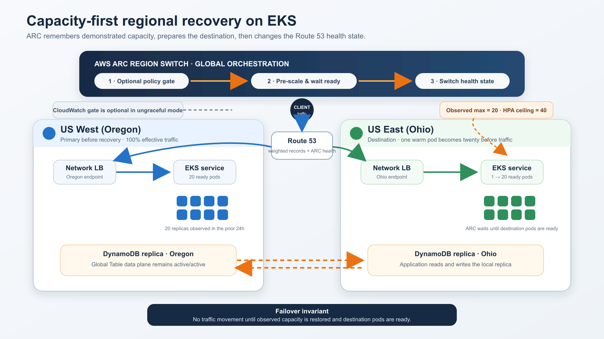
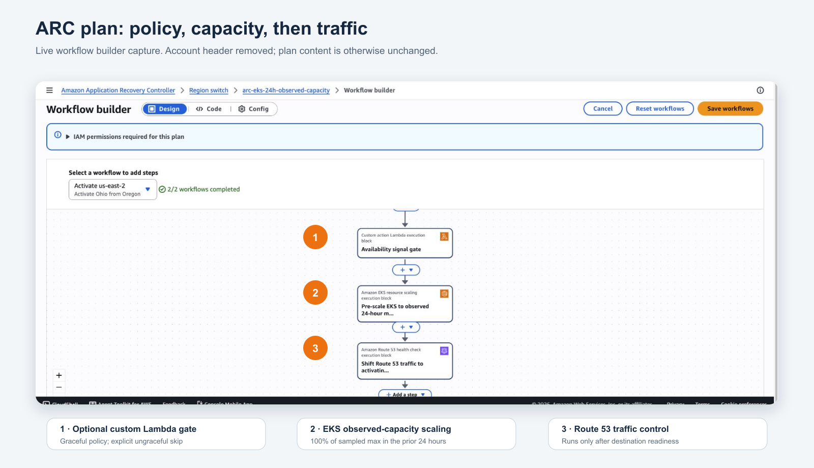
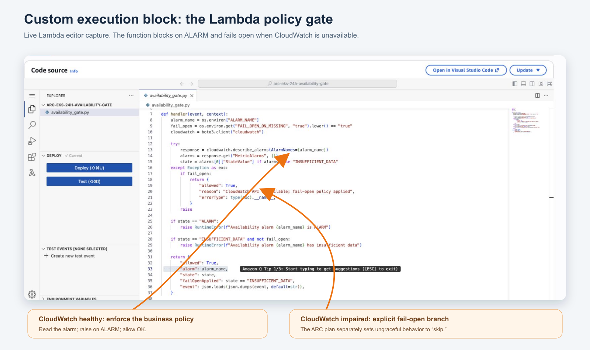
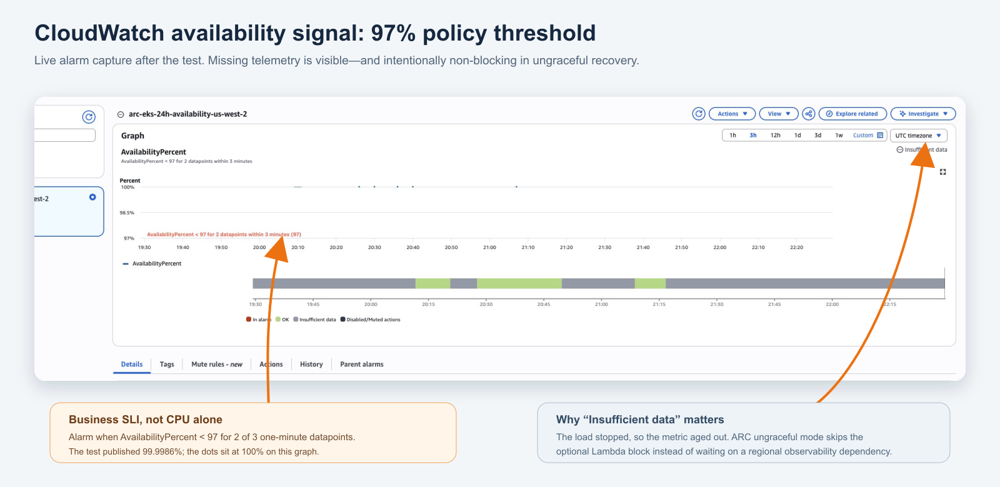
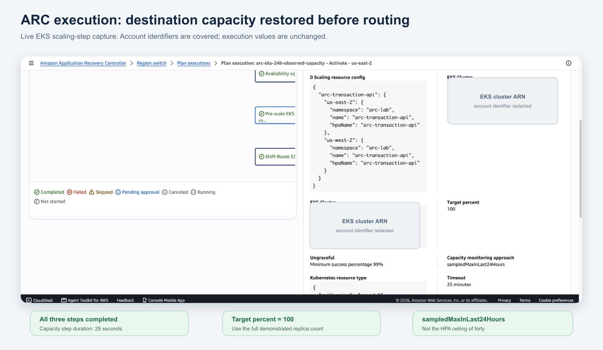
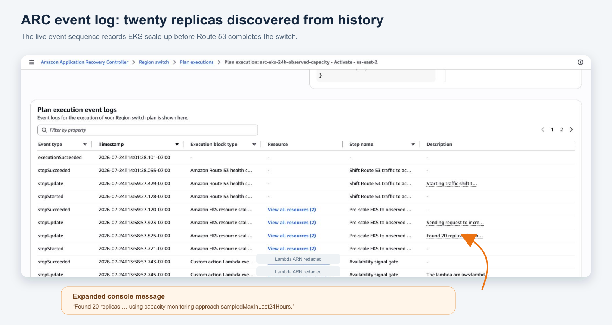
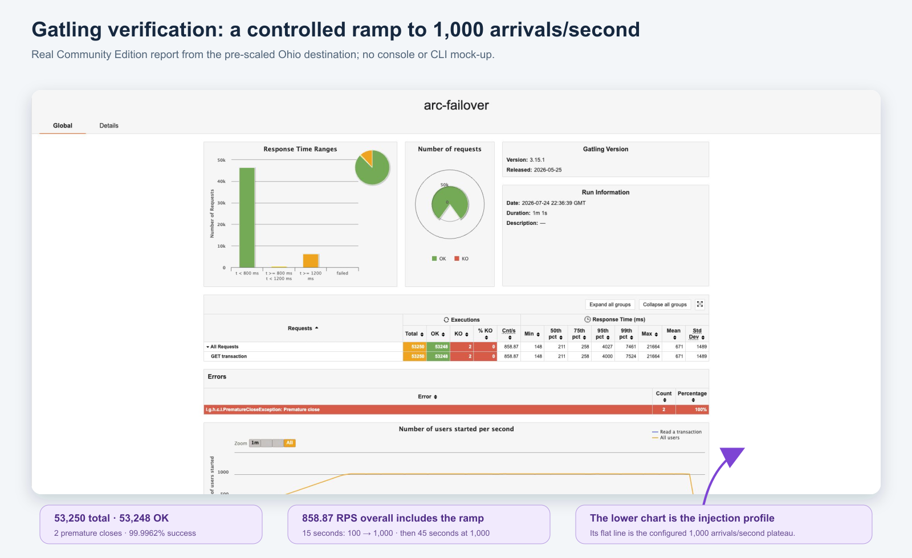

# Pre-scale an EKS regional failover from the last 24 hours—not the HPA ceiling

## A measured AWS ARC Region Switch experiment with two EKS clusters, a DynamoDB Global Table, a custom Lambda execution block, and no live CloudWatch dependency in the recovery path

Regional recovery has an awkward capacity problem.

Keeping a second Region at full production scale is expensive. Keeping it at one pod is cheap, but sending all production traffic to that pod can create a second outage while nodes and pods catch up. Scaling every service to its HPA maximum is not a good compromise either: an HPA maximum is a safety ceiling, not evidence that the service ever needed that much capacity.

Amazon Application Recovery Controller (ARC) Region Switch has a useful middle ground for EKS. Its EKS resource-scaling execution block can use `sampledMaxInLast24Hours` and recover to a percentage of the maximum replica count ARC observed during the previous 24 hours. In this experiment:

- The HPA range is 1–40.
- Oregon (`us-west-2`) is deliberately held at a demonstrated peak of 20 ready pods.
- Ohio (`us-east-2`) starts at one ready pod.
- `targetPercent` is 100.
- ARC therefore pre-scales Ohio to 20—not 40 and not one—before changing the routing state.

[AWS documents the EKS scaling block and its sampled-capacity behavior here](https://docs.aws.amazon.com/r53recovery/latest/dg/eks-resource-scaling-block.html).



*The architecture is intentionally simple: ARC applies an optional policy gate, restores the demonstrated 20-pod capacity in Ohio, waits for readiness, and only then changes the Route 53 health state. DynamoDB Global Tables keeps the data plane active/active.*

[Image: A clean two-Region architecture diagram showing the ARC policy, capacity, and traffic sequence; Oregon and Ohio EKS services; local DynamoDB replicas; the one-to-20-pod recovery; and the intentionally unused 40-pod HPA ceiling.]

The resilience property I wanted to test was what this recovery path does *not* require. ARC does not need to discover the target from a live CloudWatch CPU graph during the incident. It already has the replica history. That matters when a regional impairment also makes normal observability incomplete or unavailable.

The experiment question was:

> Can ARC take a one-pod Ohio standby, recover it to the maximum replica count observed in Oregon during the previous 24 hours, prove all 20 destination pods are ready, and only then move traffic—without requiring a live CloudWatch utilization query in the ungraceful recovery path?

## The recovery contract

The lab uses:

- One EKS Auto Mode cluster in Oregon and one in Ohio.
- One `arc-lab` namespace and one HTTP transaction service per Region.
- EKS-managed Metrics Server for pod CPU and memory metrics.
- An HPA range of 1–40 replicas with CPU-based scaling.
- `m7i.xlarge` capacity, selected to keep pod startup responsive without exceeding the experiment’s budget.
- One internet-facing Network Load Balancer per Region.
- A DynamoDB Global Table. Every pod reads and writes its local regional replica.
- Route 53 weighted CNAMEs: Oregon weight 100 and Ohio weight 0, with ARC-vended health checks attached.
- One ARC active/passive Region Switch plan.
- A custom `AvailabilityPercent` CloudWatch metric and a 97% alarm.
- One custom Lambda execution block in each Region.

The application and data tier are deployed in both Regions, but ingress begins active/passive. ARC requires an activation workflow for each Region in an active/passive plan, so the plan contains both Oregon-to-Ohio and Ohio-to-Oregon activation workflows. This experiment executes only Oregon-to-Ohio. There is no automatic failback.

The `.example` hosted zone in this account is authoritative inside Route 53 but intentionally is not a publicly delegated production domain. I validated the application directly through the destination NLB. A production implementation must use a real delegated domain.

## Cost and quota gate before creation

The live preflight estimated approximately **$1.45 per hour** with the lab ready and approximately **$2.20 per hour** during the temporary failover peak. That includes:

- Two EKS control planes.
- EKS Auto Mode compute and management charges.
- One NAT gateway per Region for private-node egress.
- One ARC Region Switch plan.
- Two NLBs.
- Two Route 53 health checks.
- The modeled DynamoDB request mix for a 1,000-TPS target, using eventually consistent reads and about 1% writes.

Data transfer and a materially different request mix remain variable. The estimate stayed below the experiment’s $5–$10/hour ceiling.

Before creating anything, the preflight checked the AWS account, both Regions, current usage, EKS cluster quotas, Standard On-Demand vCPU quotas, VPCs, Elastic IPs, NAT gateways, NLBs, IAM roles, Route 53 health checks, and the ARC plan quota. The build stopped unless the complete target state fit.

EKS standard-support clusters are currently listed at $0.10 per cluster-hour, with Auto Mode adding management charges to the underlying EC2 instances. [AWS publishes EKS pricing here](https://aws.amazon.com/eks/pricing/).

ARC Region Switch is listed at $70 per plan per month and is prorated for partial months. `$70 ÷ 730 ≈ $0.096/hour` is a useful hourly equivalent, not a claim of per-second billing. [AWS publishes ARC pricing here](https://aws.amazon.com/application-recovery-controller/pricing/).

## How the ARC plan is composed

The Ohio activation workflow contains three ordered execution blocks:

1. `CustomActionLambda` — an optional availability guard for graceful recovery.
2. `EKSResourceScaling` — capacity-first recovery using the sampled 24-hour maximum.
3. `Route53HealthCheck` — traffic movement only after the compute step finishes.

That order is the design: policy first, capacity second, traffic third.



*The live ARC workflow builder shows the actual order: custom Lambda policy, EKS observed-capacity scaling, then Route 53 traffic control.*

[Image: An annotated real AWS ARC workflow-builder screenshot with numbered callouts on the Lambda, EKS scaling, and Route 53 health-check execution blocks.]

### Block 1: the custom Lambda execution block

The custom block is defined twice in the plan—once for each activation workflow—and points to one Lambda function in each Region:

```json
{
  "executionBlockType": "CustomActionLambda",
  "name": "Availability signal gate",
  "executionBlockConfiguration": {
    "customActionLambdaConfig": {
      "timeoutMinutes": 2,
      "retryIntervalMinutes": 0.5,
      "regionToRun": "activatingRegion",
      "lambdas": [
        {
          "arn": "arn:aws:lambda:us-west-2:ACCOUNT:function:arc-eks-24h-availability-gate"
        },
        {
          "arn": "arn:aws:lambda:us-east-2:ACCOUNT:function:arc-eks-24h-availability-gate"
        }
      ],
      "ungraceful": {
        "behavior": "skip"
      }
    }
  }
}
```

There are four important choices here.

First, `regionToRun` is `activatingRegion`. A recovery plan should not depend on invoking a function in the Region it is trying to escape.

Second, graceful and ungraceful executions intentionally have different semantics. In graceful mode, ARC invokes the Lambda. In ungraceful mode, ARC skips the block. AWS documents that custom Lambda blocks support this skip behavior. [See the custom Lambda execution-block documentation](https://docs.aws.amazon.com/r53recovery/latest/dg/custom-action-lambda-block.html).

Third, the Lambda uses a business availability signal rather than CPU alone:

```python
response = cloudwatch.describe_alarms(AlarmNames=[alarm_name])
state = response["MetricAlarms"][0]["StateValue"]

if state == "ALARM":
    raise RuntimeError("Availability is below 97%")

if state == "INSUFFICIENT_DATA":
    return {"allowed": True, "failOpenApplied": True}
```

An `ALARM` state raises an error and blocks a graceful workflow. `OK` allows it to continue. `INSUFFICIENT_DATA` follows the lab’s explicit fail-open policy.

Fourth, a CloudWatch API exception follows the same fail-open policy:

```python
try:
    response = cloudwatch.describe_alarms(AlarmNames=[alarm_name])
except Exception as exc:
    return {
        "allowed": True,
        "reason": "CloudWatch API unavailable; fail-open policy applied",
        "errorType": type(exc).__name__,
    }
```

This policy is not universally correct. Some organizations will prefer fail-closed behavior for planned switchovers. For a fail-at-all-costs regional recovery, however, allowing an optional observability dependency to veto recovery can be worse than continuing.

The actual experiment used `mode: ungraceful`. ARC recorded the custom block as completed in about five seconds under its configured skip behavior, so the failover did not depend on Lambda or CloudWatch being usable.



*The real Lambda deployed in both Regions. The code reads the availability alarm, raises on `ALARM`, and has an explicit fail-open branch for a CloudWatch API failure. The ARC plan—not the function—defines the ungraceful `skip`.*

[Image: An annotated live AWS Lambda editor screenshot pointing to the CloudWatch alarm lookup, ALARM rejection, and fail-open exception branch.]



*The live `AvailabilityPercent` alarm uses a 97% threshold. The screenshot was taken after the load stopped, so it also shows the expected `INSUFFICIENT_DATA` state that the ungraceful recovery path must tolerate.*

[Image: An annotated real CloudWatch alarm screenshot with the 97% threshold, 100% run datapoints, and the post-test insufficient-data state.]

#### The IAM composition behind the custom block

Three separate permission layers are involved:

- The ARC service trusts the plan execution role `ArcEks24hRegionSwitchExecutionRole`.
- That role can get and invoke the two Lambda functions, describe both EKS clusters, list associated EKS access policies, and read the Route 53 record sets used by the plan.
- The Lambda execution role can write normal Lambda logs and call `cloudwatch:DescribeAlarms`.

ARC also has an EKS access entry in both clusters. Each entry associates the AWS-managed `AmazonARCRegionSwitchScalingPolicy`, scoped only to the `arc-lab` namespace. That policy grants the Kubernetes verbs ARC needs to read status, update scale subresources, and patch the HPA.

Plan evaluation verifies these elements before recovery. AWS says it checks that the functions exist, that Lambda concurrency is available, that the execution role has the required permissions, that both EKS resources exist, and that replica-count monitoring data has been collected.

### Block 2: pre-scale EKS from observed history

The second block is the core of the experiment:

```json
{
  "executionBlockType": "EKSResourceScaling",
  "executionBlockConfiguration": {
    "eksResourceScalingConfig": {
      "timeoutMinutes": 25,
      "capacityMonitoringApproach": "sampledMaxInLast24Hours",
      "targetPercent": 100,
      "ungraceful": {
        "minimumSuccessPercentage": 99
      },
      "kubernetesResourceType": {
        "apiVersion": "apps/v1",
        "kind": "Deployment"
      }
    }
  }
}
```

Two percentages serve different purposes:

- `targetPercent: 100` asks for the full observed maximum. The capacity target remains 20 pods.
- `minimumSuccessPercentage: 99` is the maximum accepted by the ARC API for this ungraceful field. It does not change the requested target from 20.

During execution, ARC retrieved its sampled replica maximum, set the Ohio Deployment’s desired replicas to 20, protected the HPA from scaling down, and waited for the destination replicas to become ready. EKS Auto Mode added node capacity as required.

This block completed in **29.35 seconds**, moving Ohio from **1 ready pod to 20 ready pods**.



*The completed execution exposes the settings that matter: `targetPercent` 100, `sampledMaxInLast24Hours`, a 99% ungraceful success threshold, and all three steps completed.*

[Image: An annotated real ARC execution screenshot showing all three completed steps, the 100% target, the sampled 24-hour maximum, and covered AWS account identifiers.]



*ARC’s event log records that it found 20 source replicas using `sampledMaxInLast24Hours`, sent the scale request, completed the EKS block, and only then completed the Route 53 block.*

[Image: An annotated real ARC plan-execution event-log screenshot calling out the message that 20 replicas were found from the sampled 24-hour history.]

### Block 3: Route 53 traffic control

The final block uses the Route 53 health checks that ARC allocates for the record name:

```json
{
  "executionBlockType": "Route53HealthCheck",
  "executionBlockConfiguration": {
    "route53HealthCheckConfig": {
      "hostedZoneId": "HOSTED_ZONE_ID",
      "recordName": "arc-eks-24h.example.com",
      "recordSets": [
        {
          "recordSetIdentifier": "us-west-2-primary",
          "region": "us-west-2"
        },
        {
          "recordSetIdentifier": "us-east-2-standby",
          "region": "us-east-2"
        }
      ]
    }
  }
}
```

The DNS weights remain Oregon 100 and Ohio 0. ARC changes the health-check states: Oregon becomes unhealthy and Ohio becomes healthy. Route 53 then stops serving the unhealthy non-zero-weight record and serves the healthy zero-weight record.

AWS describes this as a highly available data-plane mechanism using the Standby Takes Over Primary pattern. [See the Route 53 health-check execution-block documentation](https://docs.aws.amazon.com/r53recovery/latest/dg/route53-health-check-block.html).

In this run, the routing block took **120.88 seconds**. The slower routing block dominated the recovery time; the EKS capacity step was already complete.

## The history gate is part of the recovery design

There is a bootstrap problem with “use the last 24-hour maximum”: the instruction is not useful until ARC has sampled a meaningful replica count.

The pipeline therefore does this in order:

1. Patch the Oregon HPA minimum to 20 and hold 20 ready replicas.
2. Run a load test configured for a 1,000-TPS target.
3. Create the ARC plan with `sampledMaxInLast24Hours` and `targetPercent: 100`.
4. Keep Oregon at 20 while ARC samples the Deployment.
5. Attach the two ARC-vended health checks to the weighted records.
6. Trigger a fresh plan evaluation after the record attachment.
7. Require `evaluationState: passed` and zero warnings.
8. Write durable evidence and refuse failover when the gate is absent.

ARC evaluates immediately after plan creation or update and every 30 minutes in steady state. [AWS documents the plan-evaluation schedule here](https://docs.aws.amazon.com/r53recovery/latest/dg/working-with-rs-execution-blocks.html).

The first evaluation briefly reported that replica history was not yet available and that the vended health checks had not been attached. Those warnings were resolved. The guarded evaluation passed in **3.67 minutes**, with Oregon still at 20 ready replicas.

This ordering avoids creating a “24-hour maximum” plan whose only meaningful sample is the standby-like one-pod state.

## The GitLab, SDK, and evidence workflow

The repository includes a GitLab CI pipeline and two operator surfaces:

- Shell scripts for reproducible infrastructure creation and GitLab runners.
- A local Python driver using `boto3` and the Kubernetes SDK for execution and evidence collection.

The GitLab jobs are:

- `shellcheck`
- `manifest-validation`
- `deploy` — manual
- `prime-and-create-plan` — manual
- `failover` — manual
- `teardown` — manual

The mutating jobs share a GitLab `resource_group`, so two operators cannot modify the experiment concurrently. Non-secret `.state` evidence is passed between isolated jobs as one-day artifacts. The protected runner requires short-lived AWS credentials and the normal AWS/Kubernetes tooling.

For the live execution, I created a temporary IAM user with a temporary access key, placed the credential only in a mode-600 ignored file, and used SDK calls to:

- Verify the AWS account.
- Read and validate the ARC plan’s exact execution-block contract.
- Read EKS Deployments and HPAs through namespace-scoped EKS access entries.
- Start and poll the ARC execution.
- Capture every execution event and step time.
- Verify the Route 53 records and ARC health states.
- Call the Ohio NLB and confirm a local DynamoDB read.

After evidence collection, the temporary access key was deleted and the local credential file was removed. The ARC plan and both custom Lambda functions were deliberately retained for review.

## Read the exact source and evidence

The sanitized implementation and evidence are public in [one immutable GitHub commit](https://github.com/bhattchaitanya/aws-arc-eks-observed-capacity-failover/commit/85260573e12269f16f7bf426c2dac764ecd88f8b). The repository contains no access keys, secret values, NLB hostnames, AWS account ID, hosted-zone ID, or raw console captures.

The most useful files are:

- [The complete three-block ARC activation workflow](https://github.com/bhattchaitanya/aws-arc-eks-observed-capacity-failover/blob/85260573e12269f16f7bf426c2dac764ecd88f8b/arc/activation-workflow.example.json)
- [The custom Lambda availability gate](https://github.com/bhattchaitanya/aws-arc-eks-observed-capacity-failover/blob/85260573e12269f16f7bf426c2dac764ecd88f8b/lambda/availability_gate.py)
- [The parameterized Gatling simulation](https://github.com/bhattchaitanya/aws-arc-eks-observed-capacity-failover/blob/85260573e12269f16f7bf426c2dac764ecd88f8b/load-test/gatling/src/arc-failover.gatling.js)
- [The AWS and Kubernetes SDK execution driver](https://github.com/bhattchaitanya/aws-arc-eks-observed-capacity-failover/blob/85260573e12269f16f7bf426c2dac764ecd88f8b/scripts/arc_experiment_sdk.py)
- [The guarded GitLab CI pipeline](https://github.com/bhattchaitanya/aws-arc-eks-observed-capacity-failover/blob/85260573e12269f16f7bf426c2dac764ecd88f8b/.gitlab-ci.yml)
- [The sanitized ARC experiment result](https://github.com/bhattchaitanya/aws-arc-eks-observed-capacity-failover/blob/85260573e12269f16f7bf426c2dac764ecd88f8b/evidence/experiment-result.json)
- [The sanitized Gatling result](https://github.com/bhattchaitanya/aws-arc-eks-observed-capacity-failover/blob/85260573e12269f16f7bf426c2dac764ecd88f8b/evidence/gatling-summary.json)
- [The publication-safe evidence images](https://github.com/bhattchaitanya/aws-arc-eks-observed-capacity-failover/tree/85260573e12269f16f7bf426c2dac764ecd88f8b/evidence/screenshots)

## Measured results

The source load generator was configured for 1,000 TPS and achieved **811.40 requests/second** over about three minutes. It recorded:

- **146,791 successful transactions**
- **2 client-side timeout attempts**
- **146,793 total attempts**
- **99.9986% measured availability**

That is comfortably above the 97% availability threshold. The load generator did not reach the configured 1,000-TPS target, so I am reporting the achieved rate rather than labeling the run as a 1,000-TPS result.

### A separate Gatling verification

The failover run itself used `hey` inside Kubernetes. I did not relabel that output as Gatling. After the ARC execution, I ran a separate, real Gatling Community Edition verification directly against the already pre-scaled Ohio NLB:

- Open workload model.
- 15-second ramp from 100 to 1,000 arrivals/second.
- 45-second plateau at 1,000 arrivals/second.
- **53,250 total requests**.
- **53,248 successes and 2 premature closes**.
- **99.9962% success**.
- **858.87 requests/second overall**, because Gatling includes the ramp in the one-minute average.
- 211 ms median, 4.027 s p95, and 7.461 s p99.

This is a useful distinction. The profile reached and held a 1,000-arrivals/second injection plateau, but the full-run average was lower because the first 15 seconds intentionally ramped. The initial constant-rate attempt also exposed a local load-generator file-descriptor problem; adding a gradual ramp prevented that client-side artifact from being misreported as an EKS capacity result.

The simulation uses Gatling’s open workload model and a shared server-to-server connection pool. [Gatling documents the JavaScript injection profile here](https://docs.gatling.io/concepts/injection/) and [the shared-connection option here](https://docs.gatling.io/reference/script/http/protocol/).



*The real Gatling HTML report: 53,250 requests, two errors, and the lower injection chart ramping to a flat 1,000-arrivals/second plateau.*

[Image: An annotated real Gatling report screenshot with request totals, response-time percentiles, two errors, and the 1,000-arrivals-per-second injection plateau.]

The ARC execution then produced:

| Phase | Result |
|---|---:|
| History-gate evaluation | 3.67 minutes |
| Custom Lambda block in ungraceful mode | 5.05 seconds |
| EKS observed-capacity pre-scale | 29.35 seconds |
| Route 53 health-state switch | 120.88 seconds |
| End-to-end ARC execution and validation | 2.76 minutes |
| Ohio ready pods before/after | 1 → 20 |
| Final ARC health state | Ohio healthy, Oregon unhealthy |
| Destination response | `region: us-east-2` |
| Destination DynamoDB proof | local read returned `ddb_key: item-2` |

The ARC execution state was `completed`. A direct request to the Ohio NLB returned from an Ohio pod with a DynamoDB key and 29.05 ms application-reported latency.

## What this proves—and what it does not

This experiment demonstrates that:

- The destination capacity target can come from ARC’s observed EKS replica count instead of a live CloudWatch utilization query.
- ARC can pre-scale a one-pod recovery Region to the demonstrated 20-pod peak before changing routing.
- A custom CloudWatch-dependent policy block can protect graceful workflows without becoming a mandatory dependency for ungraceful regional recovery.
- Route 53 traffic control can run after capacity is ready, using ARC-vended health states rather than a Route 53 control-plane change during the incident.
- A DynamoDB Global Table lets the recovered application use the local replica in the activated Region.

It does not prove that monitoring is unnecessary. Availability, latency, errors, saturation, replication health, and business correctness are still essential before and after an incident.

It also does not make 100% of the observed maximum universally sufficient. Growth, diurnal peaks, retry storms, correlated failures, or hard capacity guarantees may justify extra margin or reserved capacity. The useful point is that an observed peak is a more defensible baseline than blindly scaling every service to its HPA ceiling.

## Takeaway

Warm standby capacity should be inexpensive, but recovery capacity should be evidence-based.

ARC Region Switch can remember the maximum replica count it observed, pre-scale the destination to that demonstrated level, wait for readiness, and only then move traffic. A custom execution block can add an availability policy when telemetry is healthy, while an explicit ungraceful skip keeps that optional dependency from blocking recovery when observability is impaired.

That combination reduces steady-state waste without turning the first minutes of failover into an uncontrolled autoscaling race.
